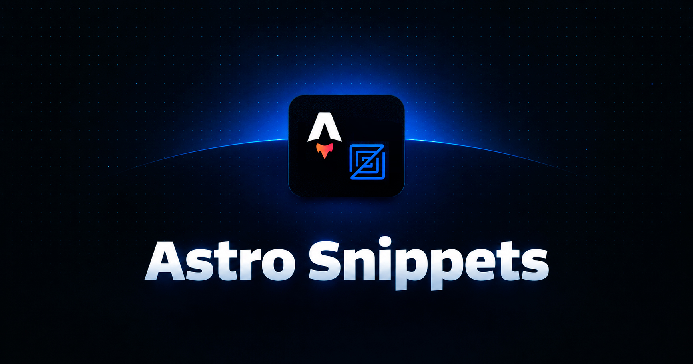

# Astro Snippets for Zed

Modern, clean, and comprehensive snippets for Astro development in Zed IDE. All snippets use the uniform `a-*` prefix.

## Installation

### User Snippets
Copy the files from `snippets/` to your Zed snippets directory:
- **Windows**: `%APPDATA%\Zed\snippets\`
- **macOS / Linux**: `~/.config/zed/snippets/`

### Dev Extension
1. Open the Command Palette (`Ctrl+Shift+P` / `Cmd+Shift+P`).
2. Run `zed: install dev extension`.
3. Select this folder.

---

## Snippets Reference

### Components, Pages & Layouts (`.astro`)

| Prefix | Description | Output |
| :--- | :--- | :--- |
| `a-comp` | Basic Component | Component with `Props` interface and container |
| `a-comp-slot` | Component with Slot | Component with props and default `<slot />` |
| `a-page` | HTML5 Page | Complete HTML5 page template |
| `a-page-layout` | Page with Layout | Page wrapped in `<Layout>` |
| `a-layout` | Base Layout | Layout with SEO metadata and `<slot />` |
| `a-layout-theme` | Layout with Theme | Layout with dark/light mode detection script |
| `a-prerender` | Prerender Toggle | `export const prerender = true;` |
| `a-gsp` | Static Paths Function | `export async function getStaticPaths() { ... }` |
| `a-page-gsp` | Dynamic SSG Page | Page with `getStaticPaths` and typed props |
| `a-page-collection` | Content Collection Page | Dynamic collection route with `render` |

### Directives & Server Islands (`.astro`)

| Prefix | Description | Output |
| :--- | :--- | :--- |
| `a-client-load` | Hydrate on Load | `client:load` |
| `a-client-idle` | Hydrate when Idle | `client:idle` |
| `a-client-visible` | Hydrate when Visible | `client:visible` |
| `a-client-media` | Hydrate on Media Query | `client:media="(max-width: 768px)"` |
| `a-client-only` | Client-only Component | `client:only="react"` |
| `a-server-defer` | Server Island Directive | `server:defer` |
| `a-server-island` | Server Island with Slot | Component with `
` |

### Slots & Fragments (`.astro`)

| Prefix | Description | Output |
| :--- | :--- | :--- |
| `a-slot` | Default Slot | `<slot />` |
| `a-slot-fallback` | Slot with Fallback | `<slot>Fallback content</slot>` |
| `a-slot-named` | Named Slot | `<slot name="header" />` |
| `a-frag-slot` | Fragment with Slot | `<Fragment slot="header">...</Fragment>` |
| `a-frag-html` | Fragment with HTML | `<Fragment set:html={rawHtml} />` |
| `a-set-html` | Set HTML Attribute | `set:html={rawHtml}` |
| `a-set-text` | Set Text Attribute | `set:text={text}` |
| `a-is-raw` | Raw Text Directive | `is:raw` |

### Actions, Sessions & Env (`.astro`, `.ts`, `.js`)

| Prefix | Scope | Description |
| :--- | :--- | :--- |
| `a-action-form` | `.astro` | `<form method="POST" action={actions.myAction}>` |
| `a-action-call` | `.astro`, `.ts` | `await Astro.callAction(actions.myAction, { ... })` |
| `a-action-define` | `.ts`, `.js` | Define action in `src/actions/index.ts` with Zod |
| `a-session-get` | `.astro`, `.ts` | `await Astro.session.get('user')` |
| `a-session-set` | `.astro`, `.ts` | `await Astro.session.set('user', data)` |
| `a-env-server` | `.astro`, `.ts` | `import { SECRET } from 'astro:env/server'` |
| `a-env-client` | `.astro`, `.ts` | `import { PUBLIC_URL } from 'astro:env/client'` |
| `a-env-config` | `astro.config` | Define `envField` schema in config |

### Template Expressions (`.astro`)

| Prefix | Description | Output |
| :--- | :--- | :--- |
| `a-map` | Array Map | `{items.map((item) => (
...
))}` |
| `a-ternary` | Ternary Operator | `{condition ? trueValue : falseValue}` |
| `a-if` | Logical AND | `{condition && (...)}` |
| `a-classlist` | Class List Directive | `class:list={['base', { active: isActive }]}` |
| `a-iife` | IIFE in Template | `{(() => { ... })()}` |

### Assets, Fonts & Navigation (`.astro`)

| Prefix | Description | Output |
| :--- | :--- | :--- |
| `a-img-import` | Import Image Component | `import { Image } from 'astro:assets';` |
| `a-image` | Image Component | `<Image src={...} alt="..." width={800} height={600} />` |
| `a-picture` | Picture Component | `<Picture src={...} formats={['avif', 'webp']} alt="..." />` |
| `a-router` | ClientRouter Component | `<ClientRouter />` |
| `a-router-import` | Import ClientRouter | `import { ClientRouter } from 'astro:transitions';` |
| `a-font` | Font Component | `` |

### Styles & Scripts (`.astro`)

| Prefix | Description | Output |
| :--- | :--- | :--- |
| `a-style` | Scoped Style Block | `` |
| `a-style-global` | Global Style Block | `` |
| `a-script` | Client Script Block | `` |
| `a-script-inline` | Inline Script Block | `` |
| `a-style-script` | Style and Script Pair | Combined `<style>` and `<script>` blocks |

### Content Collections (`.ts`, `.js`, `.astro`)

| Prefix | Scope | Description |
| :--- | :--- | :--- |
| `a-content-config` | `src/content.config.ts` | Content Layer config with `glob` loader and Zod |
| `a-collection-define` | `content.config.ts` | Collection definition with `glob` loader |
| `a-collection-data` | `content.config.ts` | Data collection with `file` loader |
| `a-collection` | `.astro`, `.ts` | `await getCollection('blog')` |
| `a-entry` | `.astro`, `.ts` | `await getEntry('blog', slug)` |

### API Endpoints & Middleware (`.ts`, `.js`)

| Prefix | Description | Output |
| :--- | :--- | :--- |
| `a-api-get` | GET Route Handler | `export const GET: APIRoute = async (...) => Response` |
| `a-api-post` | POST Route Handler | `export const POST: APIRoute = async (...) => Response` |
| `a-api-all` | Universal Route Handler | `export const ALL: APIRoute = async (...) => Response` |
| `a-api-hono` | Hono Router Endpoint | `const app = new Hono(); export const ALL = app.fetch;` |
| `a-middleware` | Astro Middleware | `export const onRequest = defineMiddleware(...)` |
| `a-redirect` | Server-side Redirect | `return Astro.redirect('/url', 302);` |

---

## Credits

Inspired by and based on:
- [Astro Snippets by SheltonLouis](https://marketplace.visualstudio.com/items?itemName=SheltonLouis.astro-snippets)
- [Snippets Astro by bastndev](https://marketplace.visualstudio.com/items?itemName=bastndev.astro-js-snippets)

---

## License

MIT
